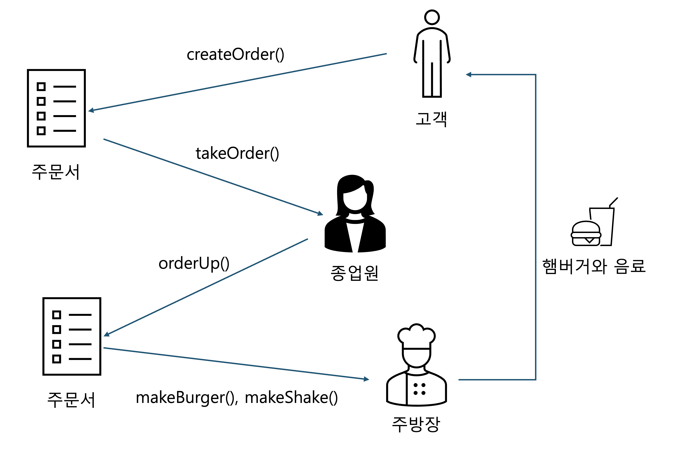

# 커맨드 패턴(Command Pattern)


**커맨드 패턴(Command Pattern)**을 사용하면 요청 내역을 객체로 캡슐화해서 객체를 서로 다른 요청 내역에 따라 **매개변수화**할 수 있습니다. 이러면 요청을 큐에 저장하거나 로그로 기록하거나 작업 취소 기능을 사용할 수 있습니다.


### IoT 리모컨을 만들어보자

리모컨은 프로그래밍이 가능한 7개의 슬롯과 각 슬롯에 할당된 기능을 켜고 끄는 ON/OFF 스위치가 있습니다. 각 슬롯은 서로 다른 가정용 기기에 연결할 수 있고 작업 취소 버튼도 장착되어 있습니다.

여러 가정용 기기 협력 업체로부터 자바 코드를 받아 보니 업체별로 사용하는 메소드가 다릅니다. 당연히 공통적인 인터페이스도 없는 상황입니다. 또한 앞으로도 이런 업체들이 계속 추가될 예정이라고 합니다. 코드를 어떻게 구현해야 할까요? (Ex. 조명 : 켜짐/꺼짐, TV : 켜짐/꺼짐/채널 변경/볼륨 설정, ...등등)

리모컨의 각 슬롯마다 업체별 기기 코드를 그대로 붙이게 되면 새로운 업체가 추가될 때마다 리모컨 클래스를 고쳐야 하고 버그 발생율도 올라갑니다. 이때 **커맨드 패턴**을 사용하여 해결할 수 있다고 합니다. 커맨드 패턴을 알아봅시다.

#### 커맨드 패턴(Command Pattern)

<figure><figcaption><p>command pattern</p></figcaption></figure>

위 그림에 대해 설명하자면

1. 주문서는 주문 내용을 캡슐화한다. 따라서 종업원은 어떤 메뉴가 주문되었는지, 누가 식사를 준비할 건지 등을 전혀 몰라도 된다.
2. 종업원은 주문서를 받고 `orderUp()` 메소드를 호출한다. 종업원의 `takeOrder()` 메소드에는 여러 고객의 주문서를 매개변수로 전달한다. 하지만 주문이 많아도 별로 어려울 것은 없다. `orderUp()` 메소드만 호출하면 식사가 준비되기 때문이다.
3. 주방장은 식사를 준비하는 데 필요한 정보를 가지고 있다. 여기서 **주방장과 종업원은 완전히 분리되어 있다.**

결국 우리가 원하는건 **리모컨 버튼이 눌렸을 때 호출되는 코드와 실제로 일을 처리하는 코드를 분리하는 것**입니다. 위 그림에 커맨드 패턴을 대입해봅시다.

<figure><figcaption></figcaption></figure>

1. 클라이언트(고객)는 커맨드 객체(주문서)를 생성해야 한다.
2. 클라이언트는 인보커 객체(종업원)의 `setCommand()` 메소드를 통해 커맨드 객체를 넘겨주고, 이 커맨드 객체는 쓰이기 전까지 인보커 객체에 보관된다.
3. 인보커에서 커맨드 객체의 `excute()` 메소드(`orderUp()`)를 호출하면 리시버(주방장)에 있는 행동 메소드가 호출된다.

#### 코드 구현

* 커맨드 인터페이스 구현 (주문서 용지) 커맨드 객체는 모두 같은 인터페이스를 구현해야 합니다. 그리고 그 인터페이스에는 메소드가 하나밖에 없습니다.

```java
public interface Command {
  public void excute();
}
```

* 조명 클래스 생성 (리시버)

```java
public class Light {

    public void on() {
        System.out.println("불이 켜집니다.");
    }

    public void off() {
        System.out.println("불이 꺼집니다.");
    }
}
```

* 조명을 켤 때 필요한 커맨드 클래스 구현 (실제 주문서)

```java
public class LightOnCommand implements Command {
  Light light;
  
  public LightOnCommand(Light light) { // excute() 메소드가 호출되면 light 객체가 리시버가 된다.
    this.light = light;
  }
  
  public void excute() {
    light.on();
  }
}
```

* 리모컨 생성

```java
public class SimpleRemoteControl {
  Command slot; // 커맨드를 저장할 슬롯이 1개 있다.
  public SimpleRemoteControl() {}
  
  public void setCommand(Command command) { // 슬롯을 가지고 제어할 명령을 설정, 얼마든지 기능을 변경할 수 있다.
    slot = command;
  }
  
  public void buttonWasPressed() {
    slot.execute();
  }
}
```

* 테스트 진행

```java
public class RemoteControlTest {
    public static void main(String[] args) {
        SimpleRemoteControl remote = new SimpleRemoteControl(); // 인보커(리모컨)
        Light light = new Light(); // 리시버(가정용 기기)
        LightOnCommand lightOn = new LightOnCommand(light); // 커맨드(리시버 정보)

        remote.setCommand(lightOn); // 인보커에 커맨드(주문서) 할당
        remote.buttonWasPressed(); // 커맨드의 execute() 명령어 사용
    }
}

// 불이 켜집니다.
```

커맨드 객체는 **일련의 행동을 특정 리시버와 연결함으로써 요청을 캡슐화한 것**입니다. 이러려면 행동과 리시버를 한 객체에 넣고, `execute()`라는 메소드 하나만 외부에 공개하는 방법을 써야 합니다. 밖에서 볼 때는 어떤 객체가 리시버 역할을 하는지, 그 리시버가 어떤 일을 하는지 알 수 없습니다.

이제 7개 슬롯을 가진 리모컨을 생성하고 기기를 연결해봅시다.

```java
public class RemoteControl {
    Command[] onCommands;
    Command[] offCommands;

    public RemoteControl() {
        onCommands = new Command[7];
        offCommands = new Command[7];

        Command noCommand = new NoCommand();
        for (int i = 0; i < 7; i++) {
            onCommands[i] = noCommand;
            offCommands[i] = noCommand;
        }
    }

    public void setCommand(int slot, Command onCommand, Command offCommand) {
        onCommands[slot] = onCommand;
        offCommands[slot] = offCommand;
    }

    public void onButtonWasPushed(int slot) {
        onCommands[slot].execute();
    }

    public void offButtonWasPushed(int slot) {
        offCommands[slot].execute();
    }

    public String toString() {
        StringBuilder sb = new StringBuilder();
        sb.append("\n----- 리모컨 -----\n");
        for (int i = 0; i < onCommands.length; i++) {
            sb.append("[slot ").append(i).append("] ").append(onCommands[i].getClass().getSimpleName()).append("   ").append(offCommands[i].getClass().getSimpleName()).append("\n");
        }
        return sb.toString();
    }
}
```

앞서 생성했던 `LightOnCommand` 클래스는 그대로 사용할 수 있습니다. 동일한 방식으로 off 클래스를 생성해봅시다.

```java
public class LightOffCommand implements Command {
    Light light;

    public LightOffCommand(Light light) {
        this.light = light;
    }

    public void execute() {
        light.off();
    }
}
```

`Light` 클래스도 더 디테일하게 수정합니다.

```java
public class Light {

    String location = "";

    public Light(String location) {
        this.location = location;
    }

    public void on() {
        System.out.println(location + " 불이 켜집니다.");
    }

    public void off() {
        System.out.println(location + " 불이 꺼집니다.");
    }
}
```

이제 테스트를 해봅시다.

```java
public class RemoteLoader {

    public static void main(String[] args) {
        RemoteControl remoteControl = new RemoteControl();

        Light livingRoomLight = new Light("거실");
        Light kitchenLight = new Light("부엌");

        LightOnCommand kitchenLightOn = new LightOnCommand(kitchenLight);
        LightOffCommand kitchenLightOff = new LightOffCommand(kitchenLight);

        remoteControl.setCommand(0, livingRoomLight::on, livingRoomLight::off); // 람다식을 이용해서 간결하게 표현
        remoteControl.setCommand(1, kitchenLightOn, kitchenLightOff);

        System.out.println(remoteControl);

        remoteControl.onButtonWasPushed(0);
        remoteControl.offButtonWasPushed(0);
        remoteControl.onButtonWasPushed(1);
        remoteControl.offButtonWasPushed(1);
    }
}

// ----- 리모컨 -----
// [slot 0] LightOnCommand   LightOffCommand
// [slot 1] LightOnCommand   LightOffCommand
// [slot 2] NoCommand   NoCommand
// [slot 3] NoCommand   NoCommand
// [slot 4] NoCommand   NoCommand
// [slot 5] NoCommand   NoCommand
// [slot 6] NoCommand   NoCommand

// 거실 불이 켜집니다.
// 거실 불이 꺼집니다.
// 부엌 불이 켜집니다.
// 부엌 불이 꺼집니다.
```

람다 표현식으로 구상 커맨드 클래스를 지울 수 있습니다. 하지만 이 방법은 `Command` 인터페이스의 추상 메소드가 하나뿐일 때만 사용할 수 있기 때문에 주의해야 합니다.

#### UNDO 기능 구현

```java
public interface Command {
  public void execute();
  public void undo();
}
```

`LightOnCommand`에서 `undo()` 메소드의 역할은 `on()` 메소드의 반대인 `off()` 메소드를 호출하는 것입니다.

```java
public class LightOnCommand implements Command {
    Light light;

    public LightOnCommand(Light light) {
        this.light = light;
    }

    public void execute() {
        light.on();
    }
  	public void undo() {
    	light.off();
  	}
}
```

이제 리모컨에서 호출할 수 있도록 `RemoteControl` 클래스를 수정해봅시다.

```java
public class RemoteControl {
    Command[] onCommands;
    Command[] offCommands;
  	Command undoCommand;

    public RemoteControl() {
        onCommands = new Command[7];
        offCommands = new Command[7];

        Command noCommand = new NoCommand();
        for (int i = 0; i < 7; i++) {
            onCommands[i] = noCommand;
            offCommands[i] = noCommand;
        }
      	undoCommand = noCommand;
    }

    public void setCommand(int slot, Command onCommand, Command offCommand) {
        onCommands[slot] = onCommand;
        offCommands[slot] = offCommand;
    }

    public void onButtonWasPushed(int slot) {
        onCommands[slot].execute();
      	undoCommand = onCommands[slot];
    }

    public void offButtonWasPushed(int slot) {
        offCommands[slot].execute();
      	undoCommand = offCommands[slot];
    }
  
  	public void undoButtonWasPushed() {
      	undoCommand.undo();
    }

    public String toString() {
        StringBuilder sb = new StringBuilder();
        sb.append("\n----- 리모컨 -----\n");
        for (int i = 0; i < onCommands.length; i++) {
            sb.append("[slot ").append(i).append("] ").append(onCommands[i].getClass().getSimpleName()).append("   ").append(offCommands[i].getClass().getSimpleName()).append("\n");
        }
      	sb.append("[undo]").append(undoCommand.getClass().getSimpleName());
        return sb.toString();
    }
}
```

테스트해봅시다.

```java
public class RemoteLoader {

    public static void main(String[] args) {
        RemoteControl remoteControl = new RemoteControl();

        Light livingRoomLight = new Light("거실");

        LightOnCommand livingRoomLightOn = new LightOnCommand(livingRoomLight);
        LightOffCommand livingRoomLightOff = new LightOffCommand(livingRoomLight);

        remoteControl.setCommand(0, livingRoomLightOn, livingRoomLightOff);

        remoteControl.onButtonWasPushed(0); // 켜짐
        remoteControl.offButtonWasPushed(0); // 꺼짐
        System.out.println(remoteControl);
        remoteControl.undoButtonPushed(); // 작업 취소(켜짐)

        System.out.println("\nA FEW MOMENTS LATER...\n");

        remoteControl.offButtonWasPushed(0); // 꺼짐
        remoteControl.onButtonWasPushed(0); // 켜짐
        System.out.println(remoteControl);
        remoteControl.undoButtonPushed(); // 작업 취소(꺼짐)
    }
}

// 거실 불이 켜집니다.
// 거실 불이 꺼집니다.
// 
// ----- 리모컨 -----
// [slot 0] LightOnCommand   LightOffCommand
// [slot 1] NoCommand   NoCommand
// [slot 2] NoCommand   NoCommand
// [slot 3] NoCommand   NoCommand
// [slot 4] NoCommand   NoCommand
// [slot 5] NoCommand   NoCommand
// [slot 6] NoCommand   NoCommand
// [undo]LightOffCommand
// 거실 불이 켜집니다.
// 
// A FEW MOMENTS LATER...
// 
// 거실 불이 꺼집니다.
// 거실 불이 켜집니다.
// 
// ----- 리모컨 -----
// [slot 0] LightOnCommand   LightOffCommand
// [slot 1] NoCommand   NoCommand
// [slot 2] NoCommand   NoCommand
// [slot 3] NoCommand   NoCommand
// [slot 4] NoCommand   NoCommand
// [slot 5] NoCommand   NoCommand
// [slot 6] NoCommand   NoCommand
// [undo]LightOnCommand
// 거실 불이 꺼집니다.
```
