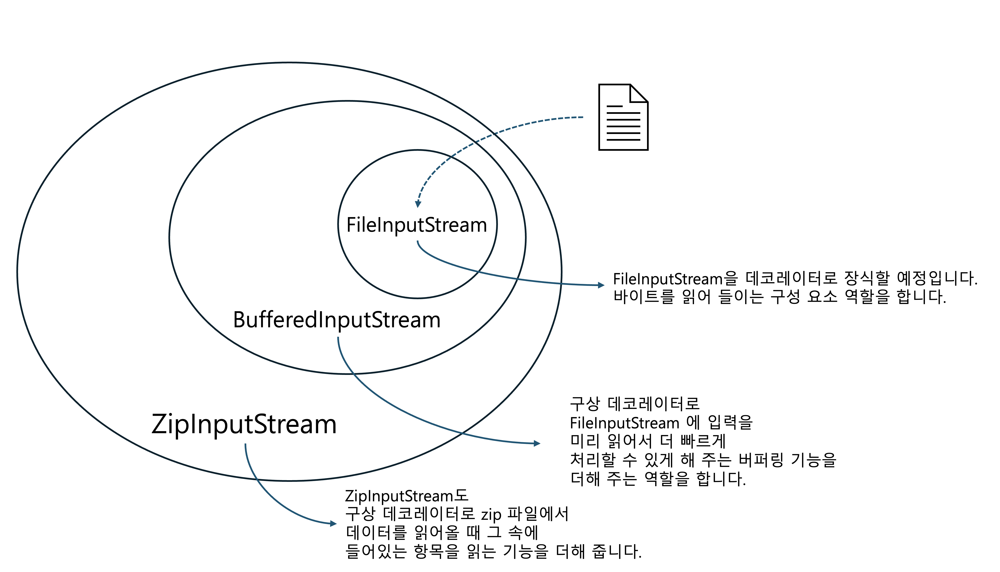

# 데코레이터 패턴(Decorator Pattern)


**데코레이터 패턴(Decorator Pattern)**은 객체에 추가 요소를 동적으로 더할 수 있다. 데코레이터를 사용하면 서브 클래스를 만들 때보다 훨씬 유연하게 기능을 확장할 수 있다.


### 문제 상황

커피 주문 시스템을 만든다고 생각해보자.

```java
public class Beverage {
  String description = "어떤 커피인지 설명합니다.";
  double milkCost = 0.0;
  double soyCost = 0.0;
  double mochaCost = 0.0;
  double whipCost = 0.0;
  
  public double cost() {
    double condimentCost = 0.0; // 첨가물의 가격
    if (hasMilk()) {
      condimentCost += milkCost;
    }
    if (hasSoy()) {
      condimentCost += soyCost;
    }
    if (hasMocha()) {
      condimentCost += mochaCost;
    }
    if (hasWhip()) {
      condimentCost += whipCost;
    }
    return condimentCost;
  }
  public boolean hasMilk() {
    return milkCost != 0.0;
  }
  public void setMilk(double milkCost) {
    System.out.println("우유 추가");
    this.milkCost = .10;
  }
  ...
}

public class DarkRoast extends Beverage {
  
  public DarkRoast() {
    description = "다크 로스트 커피";
  }
  
  public double cost() {
    return 1.99 + super.cost();
  }
}
```

`Beverage` 라는 슈퍼 클래스를 만들고 해당 클래스를 상속 받는 `DarkRost` 클래스를 만들었다. `Beverage` 클래스에는 커피 주문 시 추가할 수 있는 첨가물에 대한 가격들이 있고 `setXXX()` 함수를 통해 첨가물 추가 시 가격이 정해진다. `cost()`에서 각 첨가물의 가격을 더해 반환한다.

`DarkRost` 클래스에서는 인스턴스 생성 시 `description` 변수를 정의하고 `cost()` 함수를 통해 기본 가격에 첨가물 가격을 더한 최종 가격을 반환한다. 고객이 다크 로스트 커피에 두유와 휘핑 크림을 추가해서 주문하는걸 코드로 표현하면 아래와 같을 것이다.

```java
public class OldComponentCoffee {

    public static void main(String[] args) {
        OldBeverage oldBeverage = new OldDarkRoast();
        System.out.println(oldBeverage.getDescription());
        oldBeverage.setSoy();
        oldBeverage.setWhip();
        System.out.println("가격은 $" + oldBeverage.cost() + " 입니다.");
    }
}

// 다크 로스트 커피
// 두유 추가
// 휘핑크림 추가
// 가격은 $2.29 입니다.
```

위 코드의 문제점은 뭘까?

1. 첨가물의 가격이 바뀔 때마다 기존 코드를 수정해야 한다.
2. 첨가물의 종류가 추가될 때마다 관련 메소드를 추가해야 하고, 슈퍼 클래스의 `cost()` 메소드도 수정해야 한다.
3. 아이스티와 같은 특정 첨가물이 들어가면 안 되는 음료가 추가되는 경우 `hasWhip()` 같은 메소드를 상속 받게 되어 실수를 유발한다.

결국 우리가 원하는건 **기존 코드를 수정하지 않고 기능만 확장**시키는 것이다.


**OCP(Open-Closed Principle)** 클래스는 확장에는 열려 있고 변경에는 닫혀 있어야 한다.


모든 부분에서 OCP를 준수하는건 불가능하다. OCP를 준수하는 객체지향 디자인을 만들려면 많은 시간과 노력이 필요한데 그만큼 여유있는 상황은 흔치 않다. 또한 OCP를 지키다 보면 새로운 단계의 추상화가 필요한 경우가 있는데, 추상화를 하다 보면 코드가 복잡해진다. 그래서 **디자인한 것 중에서 가장 바뀔 가능성이 높은 부분을 중점적으로 살펴보고 OCP를 적용하는 방법이 가장 좋다.**

### 해결 방법

데코레이터 패턴을 적용해보자.

* 기존 `Beverage` 클래스의 `cost()` 메소드를 추상 메소드로 변경해서 상속을 강제한다.

```java
public abstract class Beverage {
    String description = "제목 없음";

    public String getDescription() {
        return description;
    }

    public abstract double cost();
}
```

* `Beverage` 클래스를 상속하는 `CondimentDecorator` 첨가물 데코레이터 추상 클래스를 생성한다. 특징으로 데코레이터 추상 클래스는 상속 하는 클래스인 `Beverage` 클래스를 인스턴스 변수로 가진다.

```java
public abstract class CondimentDecorator extends Beverage {
    Beverage beverage;
    public abstract String getDescription();
}
```

* `Beverage` 클래스를 상속 받는 `Espresso` 클래스를 생성한다.

```java
public class Espresso extends Beverage {

    public Espresso() {
        description = "에스프레소";
    }

    public double cost() {
        return 1.99;
    }
}
```

* `CondimentDecorator` 데코레이터 클래스를 상속 받는 첨가물 클래스 `Mocha`, `Soy` 를 생성한다. `cost()` 메소드는 음료 가격(`beverage.cost()`)에 첨가물 가격을 추가하여 반환한다.

```java
public class Mocha extends CondimentDecorator {

    public Mocha(Beverage beverage) {
        this.beverage = beverage;
    }

    public String getDescription() {
        return beverage.getDescription() + ", 모카";
    }

    public double cost() {
        return beverage.cost() + .20;
    }
}

public class Soy extends CondimentDecorator {

    public Soy(Beverage beverage) {
        this.beverage = beverage;
    }

    public String getDescription() {
        return beverage.getDescription() + ", 두유";
    }

    public double cost() {
        return beverage.cost() + .15;
    }
}
```

이제 모카 소이 라떼를 주문해보자.

```java
public class StarbuzzCoffee {

    public static void main(String[] args) {
        Beverage beverage = new Espresso();
        beverage = new Mocha(beverage);
        beverage = new Soy(beverage);
        System.out.println(beverage.getDescription() + " $" + beverage.cost());
    }
}

// 에스프레소, 모카, 두유 $2.34
```

위 로직을 그림으로 표현하면 아래와 같다.

<figure><figcaption><p>decorator pattern</p></figcaption></figure>

이제 앞서 구현한 방법의 단점들을 모두 해결할 수 있게 됐다.

1. 첨가물이 추가되면 기존 코드를 건드리지 않고 `CondimentDecorator` 클래스를 상속 받는 클래스를 생성한다.
2. `Beverage` 클래스를 상속하는 음료 클래스들과 첨가물 클래스들을 분리하여 관련 없는 상속을 방지할 수 있다.

#### Java.io 패키지

우리에게 친숙한 Java.io 패키지를 데코레이터 패턴을 통해 알아보자. 데코레이터 패턴을 알고 나면 I/O 클래스가 왜 그렇게 되어 있는지 이해할 수 있다. 파일에서 데이터를 읽어오는 스트림에 기능을 더하는 데코레이터를 사용하는 객체는 다음과 같은 형식으로 구성된다.

<figure><figcaption><p>java io component</p></figcaption></figure>

자바 I/O를 보면 데코레이터의 단점도 발견할 수 있다. 데코레이터 패턴을 사용해서 디자인을 하다 보면 잡다한 클래스가 너무 많아진다. 하지만 데코레이터가 어떤 식으로 작동하는지 이해하면 다른 사람이 데코레이터 패턴을 활용해서 만든 API를 끌어 쓰더라도 클래스를 데코레이터로 감싸서 원하는 행동을 구현할 수 있다.
