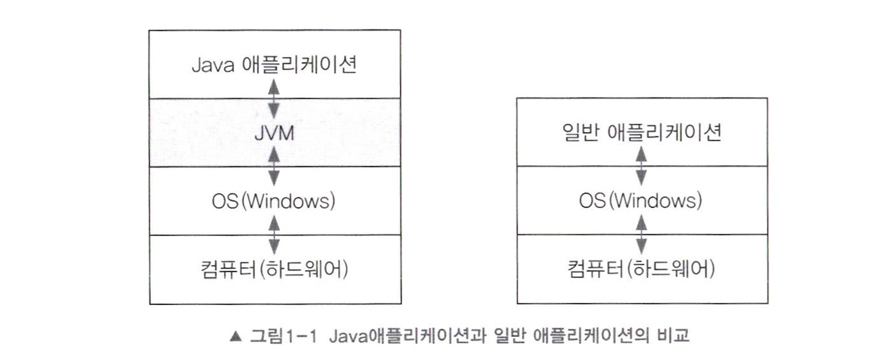

# JVM(Java Virtual Machine)

## JVM(Java Virtual Machine)

JVM 은 'Java Virtual Machine' 을 줄인 것으로 직역하자면 '자바를 실행하기 위한 가상 컴퓨터' 정도로 이해하면 된다. **자바로 작성된 애플리케이션은 모두 JVM 에서만 실행**된다. (Kotlin, Scala 와 같이 JVM 기반의 언어도 동일)

<figure><figcaption>
출처 - 자바의 정석
</figcaption></figure>

일반 애플리케이션 코드는 OS만 거치고 하드웨어로 전달되는데 비해 Java는 JVM을 한번 더 거쳐서 전달되며 **기계어로 완전히 컴파일되지 않고 실행 시에 해석되기 때문에 속도가 느리다는 단점**이 있다. 그러나 요즘엔 바이트 코드(JVM이 이해하는 컴파일된 Java 코드)를 하드웨어의 기계어로 바로 변환해주는 **JIT 컴파일러와 향상된 최적화 기술이 적용되어서 속도의 격차를 많이 줄였다.**

위 그림에서 볼 수 있듯이 일반 애플리케이션의 경우 OS와 바로 맞닿아 있기 때문에 OS 종속적이다. 그래서 OS에 맞게 변경해야 한다. 반면에 **Java 는 JVM하고만 상호작용하기 때문에 OS에 독립적이며 변경없이 어디서나 실행 가능**하다. 단, **JVM은 OS에 종속적이기 때문에 해당 OS에서 실행 가능한 JVM이 필요**하다.

<figure><figcaption>
출처 - 자바의 정석
</figcaption></figure>

그래서 일반적으로 많이 사용되는 주요 OS용 JVM은 이미 제공되고 있으며 이러한 특징으로 Java 의 유명한 슬로건인 **"Write once, run anywhere.(한번 작성하면 어디서든 실행된다.)"** 가 가능하게 된다.

### 요약

1. Java 로 작성된 애플리케이션은 JVM 에서만 실행 가능하다.
2. JVM 을 거쳐서 하드웨어로 전달되기 때문에 속도가 느리다는 단점이 있다.
3. JIT 컴파일러와 향상된 최적화 기술이 적용되어 느린 속도를 많이 개선시켰다.
4. Java 로 작성된 애플리케이션은 JVM 하고만 상호작용하면 되기 때문에 OS 에 독립적일 수 있다.
5. JVM 은 OS 에 종속적이기 때문에 OS 에 맞는 JVM 이 별도로 필요하다.

***

## JVM 의 동작 방식

JVM의 역할은 자바 애플리케이션을 클래스 로더를 통해 읽어 자바 API와 함께 실행하는 것이다.

<figure><figcaption>
출처 - <a href="https://inpa.tistory.com/">https://inpa.tistory.com/</a>
</figcaption></figure>

1. 자바 프로그램을 실행하면 JVM은 OS로부터 메모리를 할당 받는다.
2. 자바 컴파일러(javac)가 자바 소스코드(.java)를 자바 바이트 코드(.class)로 컴파일 한다.
3. Class Loader는 동적 로딩을 통해 필요한 클래스들을 로딩 및 링크하여 Runtime Data Area(실질적인 메모리 관리 영역)에 올린다.
4. Runtime Data Area에 로딩된 바이트 코드는 Execution Engine을 통해 해석된다.
5. 이 과정에서 Execution Engine에 의해 Garbage Collector의 작동과 Thread 동기화가 이루어진다.

***

## JVM 의 구조

다음은 Class Loader - Runtime Data Area - Execution Engine 부분을 상세화한 그림이다.

<figure><figcaption>
출처 - <a href="https://inpa.tistory.com/">https://inpa.tistory.com/</a>
</figcaption></figure>

* 클래스 로더 (Class Loader)
* 실행 엔진 (Execution Engine)
  * 인터프리터 (Interpreter)
  * JIT 컴파일러 (Just-in-Time)
  * 가비지 콜렉터 (Garbage Collector)
* 런타임 데이터 영역 (Runtime Data Area)
  * 메소드 영역
  * 힙 영역
  * PC Register
  * 스택 영역
  * 네이티브 메소드 영역
* 네이티브 메소드 인터페이스 (JNI - Native Method Interface)
* 네이티브 메소드 라이브러리 (Native Method Library)

***

## 클래스로더 (Class Loader)

클래스로더는 클래스 파일(\*.class)을 **동적으로 JVM에 로드**하고 **링크를 통해 메모리 영역에 배치**하는 작업을 수행하는 모듈이다.

클래스를 메모리에 올리는 로딩은 한번에 모든 클래스를 올리지 않고 어플리케이션에서 필요한 경우에 호출하여 메모리에 적재한다.
